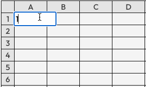
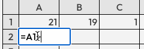

# Sheets

Sheets is a limited version of Google Sheets/Excel. The spec can be found [here](https://runbedrock.notion.site/runbedrock/Frontend-Programming-Take-Home-e587ec92a9c64c5d8d1a88bb6537414d).



### Setup
After cloning this repo, run:
```
npm install
npm run dev
```

The vite dev server will start and display the application on localhost (mine runs on localhost:5173, yours may differ).

Alternatively, you can run:
```
npm run build
npm run preview
```

### Features
The application displays a 15x15 cell spreadsheet, the size of which is static. Each cell is user editable. Valid inputs are integers or formula strings, which can be used to sum any number of other cells. Inputs that are outside of thses input parameters will be ignored.

Formula cells are reactive! If cell B5 contains a formula that references cell A2, when A2 is updated, B5 will also update. This works for any depth of cell references. Cyclical references are not supported.

#### Editing Cells
Click on any cell to edit that cell. A text input will appear when clicked. Pressing **Enter** or clicking outside of the input box will save the input you have entered. Pressing **Escape** will cancel the input and not save any changes made.

If a formula is entered, eg `=A1+B1`, that formula is instantly evaluated and displayed. If a cell has been previously defined via a formula input, editing that cell will prompt you to re-edit the previously entered input. 



### Architecture
This application was created with Vite's React/TS scaffolding, initialized via `npm create vite@latest`.

The libraries used include:
- React
- Typescript
- Redux 
- styled-components
- Vite

### Design

My intentions when building this application were the same as if I were building any tool for production use: meet the requirements and build for the future. 

The first decision that had to be made was the design of the datastore for the cell data. I initially considered using an object with fields for each cell, but landed on using a two-dimensional array, for simplicity and to ensure that my mental model of the table matched what needed to be built (in other words, I used a table to store the data because I'm using a table to display the data).

The central data store is typed as `CellData[][]`, where `CellData` is defined as:
```
export interface CellData {
    rawData: string, // exactly what the user has typed in, eg '23' or '=A4+A12+M3'
    displayData: string, // parsed value/formula which will be displayed in the sheet
}
```
The decision to store `rawData` came from a desire to enable a user to re-edit previously entered formulas, similar to how Google Sheets/Excel works. This behavior is described above in the **Editing Cells** section. All data is stored as a string for simplicity, even though the input could be just integers.

**Note**: in the 2D array, the coordinates are `[row][column]`. This means that cell A1 is `[0,0]`, A2 is `[0,1]`, B2 is `[1,1]`, etc.

Redux is used for global state management in the app, for a few reasons:
- It allows the cell data to be accessed and updated from anywhere in the component tree. This allows further feature expansion
- The business logic is abstracted out of UI components, making the components easier to read and work on.
- It avoids any prop drilling that would be necessary if the cell data was stored in the top level `<App/>` component.

#### Input handling
Handling and parsing inputs was one of the trickier parts of this project. Integer input is simple- we just display whatever the user has typed in. Formula input is where it becomes more complex. Thankfully, the spec has defined a simple set of rules for us, which makes life a lot easier. 

The presence of a '=' in the first position of an input indicates that the input is a formula. The application handles formulas as follows:

1. Identify the input as an integer or formula
   1. If integer, done. Return CellData.
   2. If formula, continue.
2. Split the input, sans '=', into an array of operands. eg. `=A1+B1 --> ["A1", "B1"]`.
3. Convert each operand into a cell coordinate. eg `B1 --> [0,1]`
4. Sum the value of all cells listed in the coordinate array and return a new CellData with that value.
5. Look for other cells that reference the cell that was just updated.
   1. If found, parse that cell's `rawData`. 
   2. Recurse as needed.

*This logic can be found in [workbookSlice.ts](src/store/workbook/workbookSlice.ts)*.

This recursive parsing ensures that cells maintain their reactivity and are always accurately up-to-date.

#### Component Layout
The basic structure of the application is as follows:
```
<App>
   <HeaderContainer>
   <Toolbar/>
   <Workbook>
      <table>
         <Cell/>
         <Cell/>
         <Cell/>
         ...
      </table>
   </Workbook>
</App>
```

Descriptions:
- [App](src/App.tsx) is the top level component.
- [Toolbar](src/App.tsx) is just a display element, but could be expanded to hold table controls.
- [Workbook](src/components/Workbook.tsx) contains the table rendering logic.
- [Cell](src/components/Cell.tsx) handles display and input logic.

### Future Work
If given more time, and the spec's limitations were removed, the first things I would build would be:

#### Support for more operations within formulas
This would immediately make the application more useful, allowing the user to use other basic operands such as `-`, `*`, `/`, etc. The tempting, bad and dangerous, but quick method to do this would be to parse the formula and replace any operands with their parsed values, and then run an `eval()` on the resultant string. This is suboptimal, to say the least, because the use of `eval()` can leave the application open to malicious actors.

A safer implementation would be to build a postfix stackbased calculator that parses the string and adds operands and operators to a stack, and calculates the result when the string is fully parsed. This could theoretically add support for more complex formulas, including the use of parens and order of operations. 

#### Persisting sheet data
I decided against building this to keep the application simple, but I would enjoy adding persistent data features to the application. The most straightforward way of doing this would be to essentially dump the global state to localStorage at some interval (or after edits, or on page close, etc). When the application is loaded next, the app would inspect localStorage for previously-saved sheet data and would initialize the sheet with that data.

#### Display of cell referenced in formulas
A fun feature to build would be to highlight the cells referenced bya formula when that cell is selected or as the user types. This could be achieved by parsing the input formula, storing the referenced cells in global state, and adding something like a `highlighted: true` field to the `CellData` object.

#### Cell coloring/styling
Adding additional fields to the `CellData` type would allow the application to have styling on a per-cell basis. This could include font styling or cell coloring.